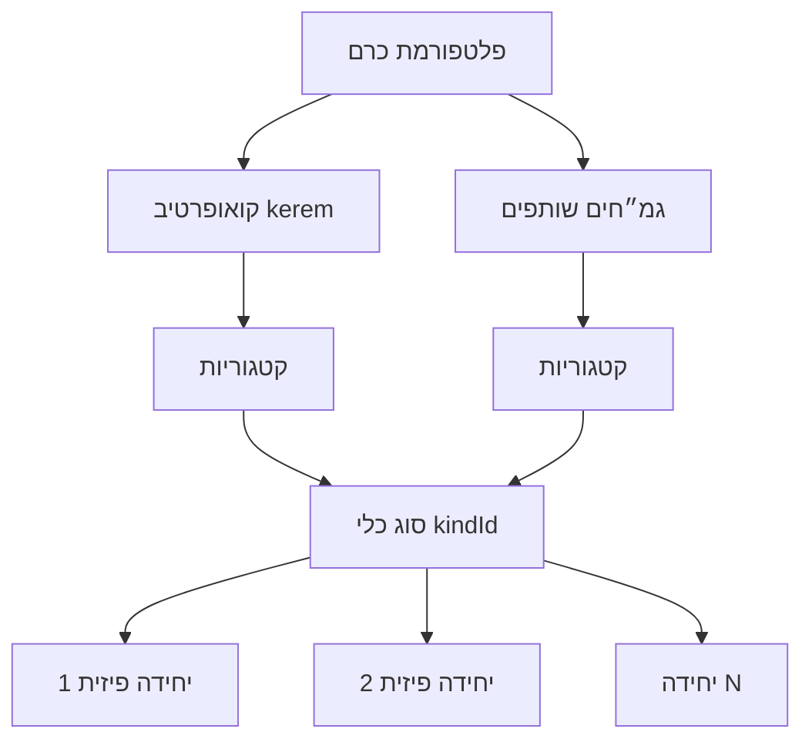
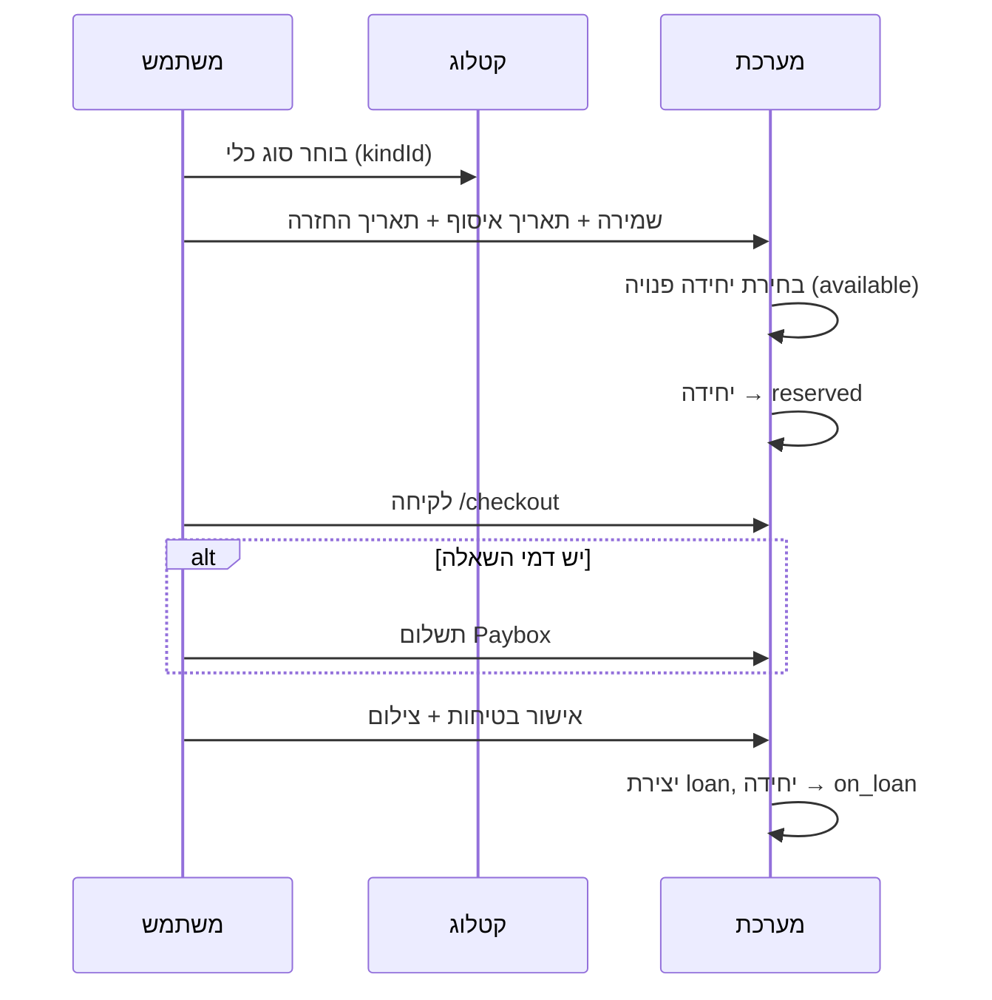
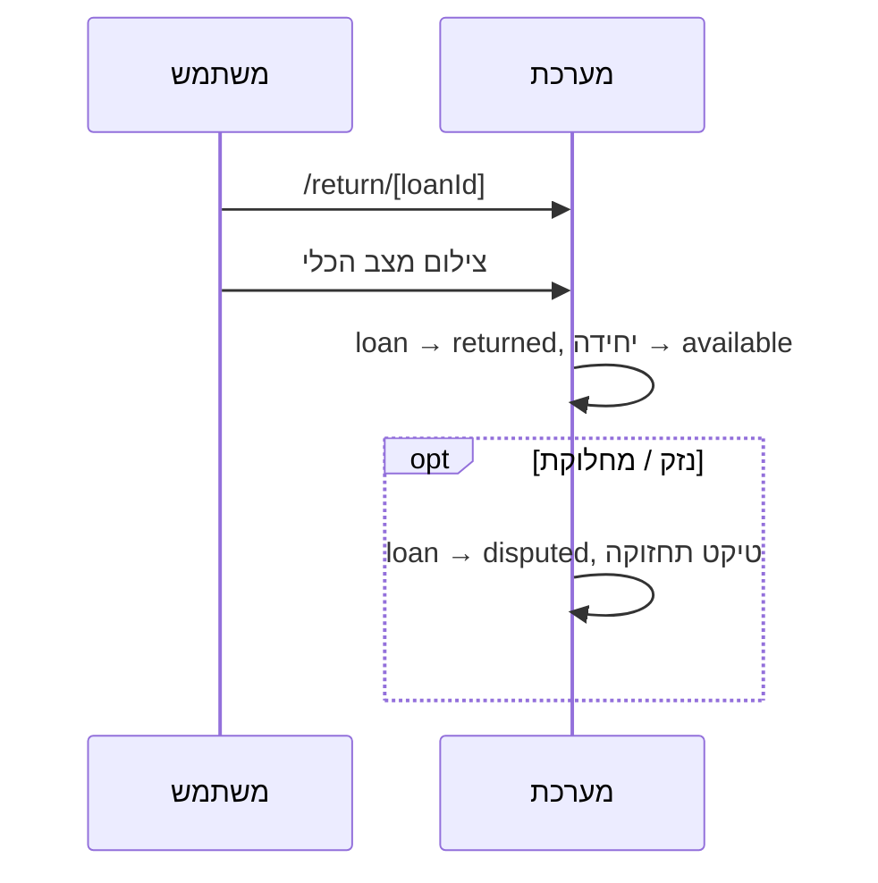
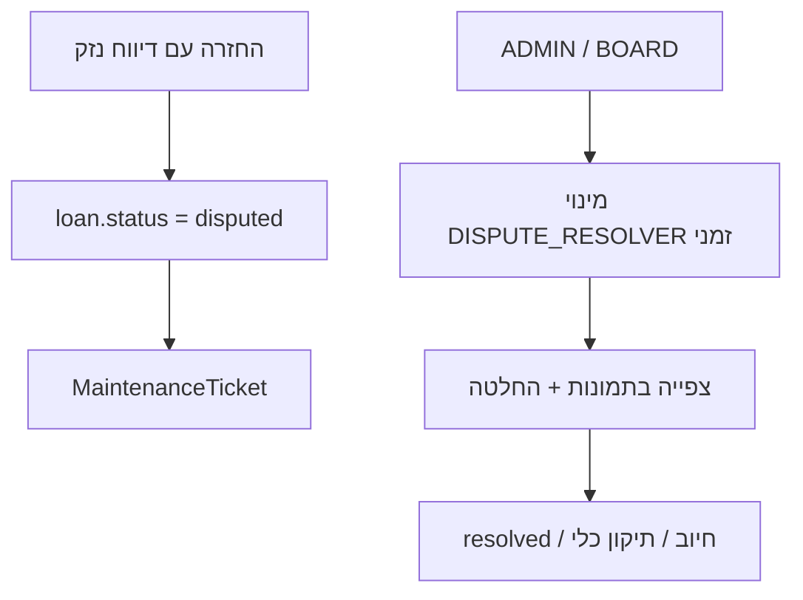

# כרם — אפיון מוצר

מסמך זה מגדיר את **היררכיית הפריטים**, **רמות ההרשאה**, **טבלת הרשאות** ו**תהליכים** במערכת.  
בסוף המסמך: מיפוי למה שכבר קיים בקוד ו**החלטות פתוחות** שדורשות בחירה.

---

## 1. חזון ומודל עסקי

הפלטפורמה מאפשרת **השאלת ציוד** בין שני סוגי מקורות:

| מקור | תיאור | בקטלוג |
|------|--------|--------|
| **קואופרטיב (כרם)** | גמ״ח הפלטפורמה הראשי — `kerem` | ללא תג מיוחד |
| **גמ״ח שותף** | גמ״ח עצמאי שצורף לפלטפורמה | תג ★ + שם הגמ״ח |

**שאלה פתוחה (קריטית):** האם כל בעל גמ״ח יכול לצרף את הגמ״ח שלו **ללא אישור**, והאתר הופך ל**פלטפורמת חסד יישובית** (פתוח לכל תושב), או שהגישה לשאילה מוגבלת **לחברי הקואופרטיב בלבד**?

| אפשרות | יתרון | חיסרון |
|--------|--------|--------|
| **א. פתוח ליישוב** | צמיחה, חסד קהילתי רחב | פיקוח, אמון, תשלומים |
| **ב. חברי קואופרטיב בלבד** | שליטה, מודל מנוי | פחות גמ״חים שותפים |
| **ג. היברידי** | גמ״ח שותף = פתוח; כלי הקואופרטיב = לחברים | מורכבות בהרשאות |

> **מימוש נוכחי:** כל משתמש מחובר יכול לשמור ולשאול מכל הגמ״חים (אין בדיקת חברות בקואופרטיב). יצירת גמ״ח שותף פתוחה ב־`/gemach/new`.

---

## 2. היררכיית פריטים



### 2.1 שכבות

| שכבה | מזהה | תיאור | דוגמה |
|------|------|--------|--------|
| **פלטפורמה** | — | האתר כולו | `cooperative-kerem.vercel.app` |
| **גמ״ח / קואופרטיב** | `gemachId` | בעלות, תמחור, קופות | `kerem`, `gemach-baby` |
| **קטגוריה** | `category` (טקסט) | קיבוץ בקטלוג | «כלי עבודה חשמליים» |
| **סוג כלי** | `kindId` | כרטיס אחד בקטלוג | `kind-saw` — «מסור עגול» |
| **יחידה פיזית** | `tool.id` | יחידה בודדת, QR, סטטוס | `tool-001`, «יחידה 1» |

### 2.2 סטטוס יחידה

| סטטוס | משמעות |
|--------|--------|
| `available` | זמין לשמירה |
| `reserved` | שמור (טרם נלקח) |
| `on_loan` | מושאל |
| `maintenance` | בתחזוקה — לא ניתן לשמור |
| `disabled` | לא זמין (הורדה זמנית) |

### 2.3 תמחור לפי גמ״ח

| מצב (`pricingMode`) | תשלום בהשאלה |
|---------------------|--------------|
| `free` | 0 |
| `loan_fee` | לפי `loanFeeMin` / `loanFeeMax` של הכלי |
| `maintenance_only` | דמי תחזוקה קבועים של הגמ״ח |

> **מימוש נוכחי:** קופת Paybox **מרכזית** לקואופרטיב. גמ״ח שותף יכול להגדיר מצב תמחור, אך **קופת Paybox נפרדת לגמ״ח — עדיין לא**.

---

## 3. רמות הרשאה (Roles)

### 3.1 מודל מוצע (יעד)

| # | תפקיד | קוד מוצע | תיאור |
|---|--------|-----------|--------|
| 1 | **משתמש רגיל** | `MEMBER` | שואל ומחזיר ציוד, רואה היסטוריה אישית |
| 2 | **מיישב מחלוקת** | `DISPUTE_RESOLVER` | הרשאה **זמנית** על השאלה/כלי ספציפי — בנוסף להרשאות חבר |
| 3 | **בעל גמ״ח** | `GEMACH_ADMIN` | מנהל גמ״ח שותף: כלים, זמינות, (עתיד: Paybox נפרד) |
| 4 | **חבר צוות בורד** | `BOARD` | ניהול קואופרטיב: קופות, מדיניות, אישור גמ״חים — **ללא** גישה מלאה לכל המערכת |
| 5 | **מנהל אדמין כללי** | `ADMIN` | שליטה מלאה בפלטפורמה |

> **מימוש נוכחי:** קיימים `MEMBER`, `GEMACH_ADMIN`, `ADMIN` בלבד. אין `BOARD`, אין `DISPUTE_RESOLVER`. סטטוס `disputed` קיים על השאלה אך ללא תפקיד ייעודי.

### 3.2 הרשאה זמנית — מיישב מחלוקת

מופעל כש**נפתחה מחלוקת** (נזק לכלי, אי־החזרה, וכו׳):

- ניתנת **למשתמש ספציפי** (לא תפקיד גלובלי קבוע)
- **היקף:** השאלה / הכלי / הטיקט הרלוונטי
- **תוקף:** עד סגירת המחלוקת
- **יכולות:** צפייה בתמונות לקיחה/החזרה, הערות, שינוי סטטוס מחלוקת, המלצה לחיוב/פטור

*(לא מיושם — מוגדר כיעד)*

---

## 4. טבלת הרשאות

סימון: ✅ מותר · 👁 צפייה בלבד · ❌ אסור · 🔜 מתוכנן · ⚠️ חלקי (קיים אך לא שלם)

### 4.1 קטלוג ושאילה (משתמש)

| פעולה | MEMBER | DISPUTE_RESOLVER | GEMACH_ADMIN | BOARD | ADMIN |
|--------|--------|------------------|--------------|-------|-------|
| צפייה בקטלוג כלים | ✅ | ✅ | ✅ | ✅ | ✅ |
| שמירת כלי (הזמנה) | ✅ | ✅ | ✅* | ✅* | ✅ |
| ביטול שמירה שלי | ✅ | ✅ | ✅ | ✅ | ✅ |
| לקיחה (checkout) | ✅ | ✅ | ✅* | ✅* | ✅ |
| החזרה | ✅ | ✅ | ✅* | ✅* | ✅ |
| «ההשאלות שלי» — היסטוריה + סטטוס | ✅ | ✅ | ✅ | ✅ | ✅ |
| דיווח נזק / פתיחת טיקט תחזוקה | ✅ | ✅ | ✅ | ✅ | ✅ |

\* בעל גמ״ח / בורד — כמשתמש רגיל; אין הטבה מיוחדת בשאילה.

### 4.2 ניהול גמ״ח שותף

| פעולה | MEMBER | DISPUTE_RESOLVER | GEMACH_ADMIN | BOARD | ADMIN |
|--------|--------|------------------|--------------|-------|-------|
| יצירת גמ״ח חדש (`/gemach/new`) | ❌** | ❌ | ✅ (שלו) | 🔜 | ✅ |
| לוח בקרה גמ״ח (`/admin/gemach`) | ❌ | ❌ | ✅ (שלו) | 👁 | ✅ (כולם) |
| הוספת כלים | ❌ | ❌ | ✅ | ❌ | ✅ |
| עריכת פרטי כלי (שם, תיאור, תמחור) | ❌ | ❌ | 🔜 | ❌ | ✅ |
| סימון זמין / לא זמין / תחזוקה | ❌ | ❌ | ✅ | ❌ | ✅ |
| קופות הגמ״ח (Paybox נפרד) | ❌ | ❌ | 🔜 | 👁 | ✅ |
| הסרת גמ״ח מהפלטפורמה | ❌ | ❌ | 🔜 | 🔜 | ✅ |

\*\* **מימוש נוכחי:** כל משתמש מחובר **יכול** ליצור גמ״ח — סותר את המודל המוצע אם נבחר «ב. חברים בלבד» או «אישור בורד».

### 4.3 ניהול קואופרטיב ופלטפורמה

| פעולה | MEMBER | DISPUTE_RESOLVER | GEMACH_ADMIN | BOARD | ADMIN |
|--------|--------|------------------|--------------|-------|-------|
| לוח בקרה פלטפורמה (`/admin`) | ❌ | ❌ | ❌ | 🔜 | ✅ |
| ניהול חברים + היסטוריה | ❌ | ❌ | ❌ | 🔜 | ✅ |
| מתן / שלילת ADMIN | ❌ | ❌ | ❌ | ❌ | ✅ |
| קופות קואופרטיב | ❌ | ❌ | ❌ | 🔜 | ✅ |
| אישור / השעיית גמ״ח שותף | ❌ | ❌ | ❌ | 🔜 | ✅ |
| כלים של קואופרטיב kerem | ❌ | ❌ | ❌ | 🔜 | ✅ |

### 4.4 מחלוקות

| פעולה | MEMBER | DISPUTE_RESOLVER | GEMACH_ADMIN | BOARD | ADMIN |
|--------|--------|------------------|--------------|-------|-------|
| פתיחת מחלוקת (בהחזרה) | ✅ | ✅ | ❌ | ❌ | ✅ |
| צפייה במחלוקת שלי | ✅ | ✅ | 👁*** | 👁 | ✅ |
| יישוב מחלוקת | ❌ | ✅ (זמני) | ❌ | 🔜 | ✅ |

\*\*\* בעל גמ״ח רואה מחלוקות על **כלים שלו** בלבד.

---

## 5. תהליכים (Flows)

### 5.1 שמירה ולקיחה



**מימוש:** `/tools` → `/tools/[id]/reserve` → `/my-loans` → `/checkout/[reservationId]`

### 5.2 החזרה



**מימוש:** `/return/[loanId]` — סריקת QR **כבויה** (`REQUIRE_QR_SCAN = false`).

### 5.3 ביטול שמירה

משתמש → «בטל שמירה» ב־`/my-loans` → שריון `cancelled`, יחידה חוזרת ל־`available`.

### 5.4 ניהול זמינות (בעל גמ״ח)

בעל גמ״ח → `/admin/gemach` → טבלת כלים (שורה לכל **סוג**) →  
«לא זמין» / «תחזוקה» / «החזר לזמין» (ברמת סוג או יחידה).

**מימוש:** קיים. **עריכת פרטי כלי** (שם, תיאור) — **חסר**.

### 5.5 הצטרפות גמ״ח שותף

```mermaid
flowchart LR
  A[משתמש מחובר] --> B[/gemach/new]
  B --> C[יצירת gemachim + gemachAdminIds]
  C --> D[/admin/gemach/tools/new]
  D --> E[כלים מופיעים בקטלוג עם ★]
```

**שאלה פתוחה:** האם שלב **אישור בורד** נדרש בין B ל־E?

### 5.6 מחלוקת ויישוב (יעד)



**מימוש:** `disputed` + `MaintenanceTicket` — חלקי; אין UI ליישוב ואין תפקיד מיישב.

### 5.7 ניהול חברים (ADMIN)

`/admin/members` — רשימת כל החברים, סינון, היסטוריית השאלות/שמירות, מתן ADMIN.

---

## 6. מסכים עיקריים לפי תפקיד

| מסך | נתיב | מי רואה |
|-----|------|---------|
| קטלוג | `/tools` | כולם (מחוברים) |
| ההשאלות שלי | `/my-loans` | MEMBER+ |
| לקיחה | `/checkout/[id]` | בעל השמירה |
| החזרה | `/return/[id]` | שואל |
| הוסף גמ״ח | `/gemach/new` | כל מחובר* |
| לוח גמ״ח | `/admin/gemach` | GEMACH_ADMIN / ADMIN |
| הוסף כלי | `/admin/gemach/tools/new` | GEMACH_ADMIN / ADMIN |
| לוח פלטפורמה | `/admin` | ADMIN |
| חברים | `/admin/members` | ADMIN |
| קופות | `/admin/pots`, `/admin/gemach/pots` | ADMIN / GEMACH_ADMIN |

---

## 7. החלטות פתוחות — לסגירה

| # | נושא | אפשרויות | המלצה לדיון |
|---|------|-----------|-------------|
| 1 | **מי יכול לשאול?** | כל תושב / חברי קואופרטיב בלבד / לפי גמ״ח | קובע אם «חסד יישובי» או «מנוי קואופרטיב» |
| 2 | **מי יכול לפתוח גמ״ח?** | כולם / בקשה + אישור בורד / ADMIN בלבד | היום: כולם |
| 3 | **Paybox לגמ״ח שותף** | קופה נפרדת / חלוקה מרכזית / ללא תשלום בלבד | נדרש לפני monetization של שותפים |
| 4 | **תפקיד BOARD** | נפרד מ־ADMIN / מיזוג חלקי | קופות + אישור גמ״חים, בלי שינוי ADMIN |
| 5 | **מיישב מחלוקת** | תפקיד זמני per-ticket / BOARD / ADMIN בלבד | תלוי בנפח מחלוקות |
| 6 | **עריכת כלי** | ברמת kind (כל היחידות) / per unit | kind — לרוב מספיק |
| 7 | **QR בלקיחה/החזרה** | חובה / אופציונלי | היום: כבוי |

---

## 8. מיפוי קוד (מימוש נוכחי)

| נושא | קבצים |
|------|--------|
| תפקידים | `src/lib/admin.ts`, `src/lib/types.ts` (`MemberRole`) |
| גמ״ח | `src/lib/gemach.ts`, `src/app/gemach/new` |
| קיבוץ כלים | `src/lib/tool-kinds.ts` |
| שמירה / השאלה | `src/app/api/reservations`, `src/app/api/loans` |
| ניהול זמינות | `src/app/api/admin/gemach/tools/status` |
| חברים | `src/app/admin/members`, `src/app/api/admin/members` |
| דגלים | `src/lib/features.ts` (`REQUIRE_QR_SCAN`) |

---

## 9. גרסאות מסמך

| תאריך | שינוי |
|--------|--------|
| 2026-06-17 | גרסה ראשונה — היררכיה, הרשאות, תהליכים, פערים |
